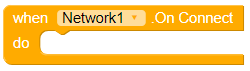

# Network

This is a very simple component to allow you to get some basic network info about the device.

## Events

### On Connect

The On Connect Event is called when the device connects to a WiFi or mobile network.

### On Disconnect

The On Disconnect Event is called when the device disconnects from a WiFi or mobile network.

## Methods

### Is Connected

Is Connected returns True or False depending whether the device is connected to a WiFi or mobile network.

### Type

Type returns the type of network that the device is connected to. Possible types are WiFi and Mobile.

