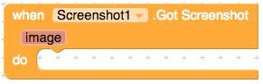

# Screenshot

Screenshot component lets you to take screenshots of your current screen.

* [Got Screenshot](screenshot.md#got-screenshot)
* [Take Screenshot](screenshot.md#take-screenshot)
* [Allow Screenshots](screenshot.md#allow-screenshots)
* [Notification Big Style](screenshot.md#notification-big-style)
* [Notification Share Style](screenshot.md#notification-share-style)
* [Notification Title](screenshot.md#notification-title)
* [Notification](screenshot.md#notification)
* [Preview](screenshot.md#preview)

## Events

### Got Screenshot

When the user got the screenshot.

## Methods

### Take Screenshot

Allows the user to take a Screenshot.

## Properties

### Allow Screenshots

Allows the user to take a Screenshot manually on that page. This acts like a permission. If false, there will be a toast warning notifying the user that its not allowed to take screenshots on that page.

### Notification Big Style

Makes the notification style big.

### Notification Share Style

Makes the notification style sharable.

### Notification Title

Allows the user to change the notification title.

### Notification

The option to show notifications or not.

### Preview

The option to show preview or not.

