# Google Maps

Google Maps component allows users to use Google Maps integrated directly to their apps.

* [Camera Position Changed](google-maps.md#camera-position-changed)
* [Finished Dragging Circle](google-maps.md#finished-dragging-circle)
* [Info Window Clicked](google-maps.md#info-window-clicked)
* [Map is Ready](google-maps.md#map-is-ready)
* [On Location Changed](google-maps.md#on-location-changed)
* [On Map Click](google-maps.md#on-map-click)
* [On Map Long Click](google-maps.md#on-map-long-click)
* [On Marker Click](google-maps.md#on-marker-click)
* [On Marker Drag](google-maps.md#on-marker-drag)
* [On Marker Drag End](google-maps.md#on-marker-drag-end)
* [On Marker Drag Start](google-maps.md#on-marker-drag-start)
* [Enable Compass](google-maps.md#enable-compass)
* [Enable Map Camera Pos Change Listener](google-maps.md#enable-map-camera-pos-change-listener)
* [Get Markers](google-maps.md#get-markers)
* [Move Camera](google-maps.md#move-camera)
* [Remove Circle](google-maps.md#remove-circle)
* [Remove Marker](google-maps.md#remove-marker)
* [Set Map Type](google-maps.md#set-map-type)
* [Update Circle](google-maps.md#update-circle)
* [Update Marker](google-maps.md#update-marker)
* [Add Overlay](google-maps.md#add-overlay)
* [Add Polygon](google-maps.md#add-polygon)
* [Add Tile Overlay](google-maps.md#add-tile-overlay)
* [Clear All Polygons](google-maps.md#clear-all-polygons)
* [Draw Central Square](google-maps.md#draw-central-square)
* [Get My Location](google-maps.md#get-my-location)
* [Get Bounding Box](google-maps.md#get-bounding-box)
* [Add Circle](google-maps.md#add-circle)
* [Add Markers](google-maps.md#add-markers)
* [Add Markers from Json](google-maps.md#add-markers-from-json)
* [Add Markers Hue](google-maps.md#add-markers-hue)
* [Bound Camera](google-maps.md#bound-camera)
* [Enable Map Long Click Listener](google-maps.md#enable-map-long-click-listener)
* [Height](google-maps.md#height)
* [Height Percent](google-maps.md#height-percent)
* [Visible](google-maps.md#visible)
* [Width](google-maps.md#width)
* [Width Percent](google-maps.md#width-percent)

### Events

#### Camera Position Changed

When the camera angle position is changed.

#### Finished Dragging Circle

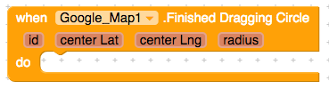

When dragging a circle is finished.

#### Info Window Clicked

When the info windows is clicked.

#### Map is Ready

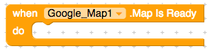

When the map is ready.

#### On Location Changed

When the location changes.

#### On Map Click

When the user clicks on the map.

#### On Map Long Click

When the user long-clicks on the map.

#### On Marker Click

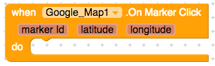

When the user clicks on the marker.

#### On Marker Drag

When the user drags a marker.

#### On Marker Drag End

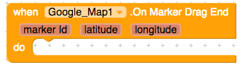

When the user ends dragging a marker.

#### On Marker Drag Start

When the user starts dragging a marker.

## Methods

#### Enable Compass

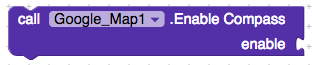

Enables the compass.

#### Enable Map Camera Pos Change Listener

Enables the Map Camera Position Change Listener.

#### Get Markers

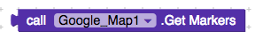

Gets markers.

#### Move Camera

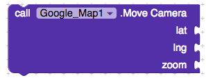

Moves the camera.

#### Remove Circle

Removes the circle.

#### Remove Marker

Removes the marker.

#### Set Map Type

Sets the map type.

#### Update Circle

Updates the circle.

#### Update Marker

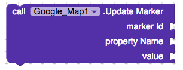

Updates the marker.

#### Add Overlay

Adds an overlay.

#### Add Polygon

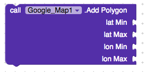

Adds a polygon.

#### Add Tile Overlay

Adds a tile overlay.

#### Clear All Polygons

Clears all polygons.

#### Draw Central Square

Draws a central square.

#### Get My Location

Gets the users' location.

#### Get Bounding Box

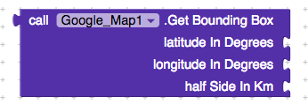

Gets the bounding box.

#### Add Circle

Adds a circle to the map.

#### Add Markers

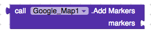

Adds markers to the map.

#### Add Markers from Json

Adds markers from json.

#### Add Markers Hue

Adds markers from hue.

#### Bound Camera

Bounds the camera.

#### Enable Map Long Click Listener

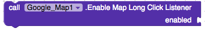

Enables the map long click listener.

### Properties

#### Height

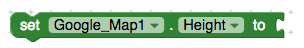

Sets the height of the map.

#### Height Percent

Sets the height of the map in percent.

#### Visible

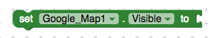

Sets the visibility of the map. Visible, or not.

#### Width

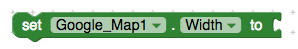

Sets the width of the map.

#### Width Percent

Sets the width of the map in percent.

