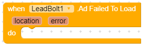

# Leadbolt

The LeadBolt component allows you to show both Rewarded and Interstitial ads in your apps.

## Properties

### API Key \(designer only\)

## Events

### Ad Cached

### Ad Clicked

### Ad Closed

### Ad Failed To Load

### Ad Loaded

## Methods

### Is Network Ad Ready

### Is Rewarded Ad Ready

### Load Network Ad

### Load Rewarded Ad

### Show Network Ad

### Show Rewarded Ad

