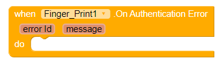

# Finger Print

Component to check for a FingerScanner and read fingerprints from the scanner.

### Events

#### On Authentication Error

Triggers when there is a Authentication Error.

#### On Authentication Help

Triggers when there is a Authentication Help.

#### On Authentication Failed

Triggers when the Authentication Failed.

#### On Authentication Succeeded

Trigger when the Authentication Succeeded.

## Methods

#### Has Fingerprint Scanner

True if hardware is present and functional, false otherwise.

#### Has Fingers Added

True if at least one fingerprint is enrolled, false otherwise.

#### Authenticate

Authenticate the user with a Fingerprint scanner.

#### Cancel Scan

Cancel the current Fingerprint Scan.

### Properties

#### Light Theme

Sets the current theme.

#### Use Dialog

Whether to use a dialog.

#### Dialog Title

Sets the dialog title/

#### Dialog Help Text

Sets the dialog help text.

