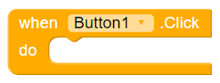
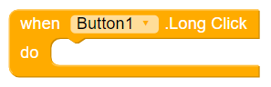
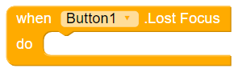
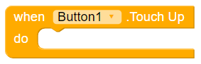
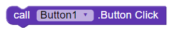
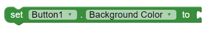
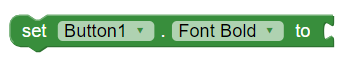
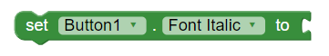
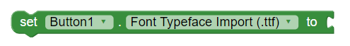
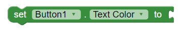

# Button

## Events

### Click

When the users clicks on the button.

### Got Focus

Indicates the cursor moved over the button so it is now possible to click it.

### Long Click

When the users helds the button down.

### Lost Focus

Indicates the cursor moved away from the button so it is now no longer possible to click it.

### Touch Down

When the user press the button down.

### Touch Up

When the user releases the button.

## Methods

### Button Click

Preform a click on the button.

## Properties

### Touch Color

Set's the touch color \(ripple touch effect\) for a button.

### Background Color

Sets the button's background color.

### Enabled

The button can listen to touches only if _Enabled_ is set to true.

### Font Bold

If set, button text is displayed in bold.

### Font Italic

If set, button text is displayed in italic.

### Font Size

The size of the font that is displayed on the button.

### Font Typeface Import

The font family for the button text.

### Height

The height of the button.

### Image

The image that is displayed on the button.

### Show Feedback

Specifies if a visual feedback should be shown for a button that as an image as background.

### Text

The text that is displayed on the button.

### Text Color

The color of the text that is showed on the button.

### Visible

Specifies whether the component should be visible on the screen. Value is true if the component is showing and false if hidden.

### Width

The width of the button.

