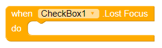
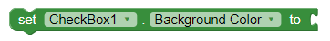
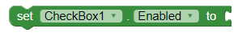
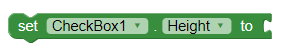
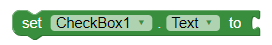
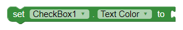
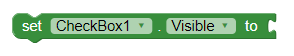

# Checkbox

## Events

### Changed

User tapped and released check box.

### GotFocus

Check box became the focused component.

### LostFocus

Check box stopped being the focused component.

## Properties

### BackgroundColor

Color for check box background.

### Checked

True if the box is checked, false otherwise.

**Checkbox Color**

Change the checkbox component color

### Enabled

If set, user can tap check box to cause action.

### Height

Check box height \(y-size\).

### Width

Check box width \(x-size\).

### Text

Text to display on check box.

### TextColor

Color for check box text.

### Visible

If set, check box is visible.

