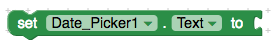
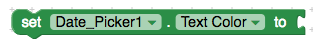
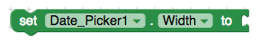
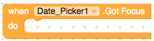
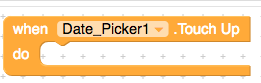

# Date Picker

## Properties

### BackgroundColor

Returns the button's background color

### Day

the Day of the month that was last picked using the DatePicker.

### Enabled

If set, user can tap check box to cause action.

### FontBold

If set, button text is displayed in bold.

### FontItalic

If set, button text is displayed in italics.

### FontSize

Point size for button text.

### FontTypeface \(designer only\)

Font family for button text.

### Height

To set it's height.

### Image

Image to display on button.

### Instant

Instant of date. This instant can be used with [Clock](http://ai2.appinventor.mit.edu/reference/components/sensors.html#Clock)

component for date documentation, conversion, and matriculation.

### Month

the number of the Month that was last picked using the DatePicker. Note that months start in 1 = January, 12 = December.

### MonthInText

Returns the name of the Month that was last picked using the DatePicker, in textual format.

### Shape \(designer only\)

Specifies the button's shape \(default, rounded, rectangular, oval\). The shape will not be visible if an Image is being displayed.

### ShowFeedback

Specifies if a visual feedback should be shown for a button that as an image as background.

### Text

Text to display on button.

### TextAlignment \(designer only\)

Left, center, or right.

### TextColor

Color for button text.

### Visible

Specifies whether the component should be visible on the screen. Value is true if the component is showing and false if hidden.

### Width

To set it's width.

### Year

the Year that was last picked using the DatePicker

## Events

### AfterDateSet

Event that runs after the user chooses a Date in the dialog

### GotFocus

Indicates the cursor moved over the button so it is now possible to click it.

### LostFocus

Indicates the cursor moved away from the button so it is now no longer possible to click it.

### TouchDown

Indicates that the button was pressed down.

### TouchUp

Indicates that a button has been released.

## Methods

### LaunchPicker

Launches the DatePicker popup.

### SetDateToDisplay

#### Parameters: \(number year, number month, number day\)

Allows the user to set the date to be displayed when the date picker opens. Valid values for the month field are 1-12 and 1-31 for the day field.

### SetDateToDisplayFromInstant

#### Parameter: \(InstantInTime instant\)

Allows the instant to set the year, month, and day to be displayed when the date picker opens. Instants are used in Clock, DatePicker, and TimePicker components.

