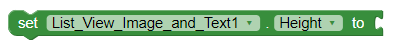
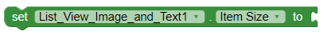
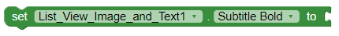
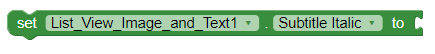
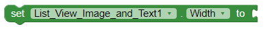
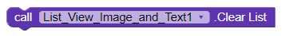
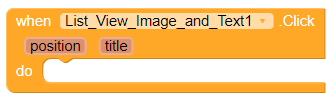

# List View Image and Text

This is a visible component that displays a list of a image and two labels

## Properties

### BackgroundColor

The background color of the listview

### Divider Color

The color of the divider between listitems.

### Height

Determines the height of the list on the view.

### Item Size

The size of the items in the list \(1 = Normal, 2 = Small and 3 = Big\).

### Subtitle Bold

Whether the subtitle is bold.

### Subtitle Color

The text color of the subtitle.

### Subtitle Italic

Whether the subtitle is italic.

### Title Bold

Whether the title is bold.

### Title Color

The text color of the title.

### Title Italic

Whether the title is italic.

### Visible

Specifies whether the component should be visible on the screen. Value is true if the component is showing and false if hidden.

### Width

Determines the width of the list on the view.

## Methods

### Add Item\(image, title, subtitle\)

Add a item to the listview from 3 pieces of text.

### Add Item From List\(list\)

Add a item to the listview with the content of a list.

### Clear List\(\)

Remove all items from the list.

### Remove Item\(positon\)

Remove an item from the list at a certain position.

### Update Item\(image, title, subtitle\)

Update the image, title and subtitle of a item in the list by the position.

## Events

### Click\(\)

An event that triggers when the user clicks on a item in the list.

### Long Click\(\)

An event that triggers when the user long clicks on a item in the list.

